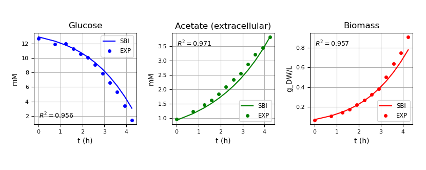

<h1>Simulation-Based Inference (SBI) Framework for Kinetics–ODE Model Calibration</h1>

This repository provides a **Simulation-Based Inference (SBI)** framework designed to fine-tune 
parameters in kinetics–ODE models. Traditional inference methods rely on explicit likelihood functions, 
which can become intractable or unavailable for complex mechanistic systems.

SBI overcomes this limitation by treating the mechanistic model as a *simulator*: given a set of inputs `x`, 
it produces outputs `y`. Instead of requiring closed-form likelihoods, SBI uses these simulated 
input–output pairs to train a neural density estimator (Coupling Flow) that approximates the posterior 
distribution `p(y | x)`. This enables inference of which inputs — ODE parameters — 
are most consistent with observed experimental data, even in nonlinear or high-dimensional systems. This approach is called **Neural Posterior Estimation (NPE)**.

---

### Framework Background

The framework builds upon prior work and inspiration from:
- **Cranmer et al. (2020):** Methodology for simulation-based inference  
- **Millard et al. (2021):** Experimental data and kinetic modeling  
- **[BayesFlow SIR Posterior Estimation Example](https://bayesflow.org/main/_examples/SIR_Posterior_Estimation.html):** Code implementation reference  

---

### Application: Modeling Overflow Metabolism in *E. coli*

**Overflow metabolism** refers to the phenomenon where cells produce apparently wasteful by-products during growth on glucose, even when oxygen is abundant. Millard et al. (2021) developed a kinetic model of *E. coli* metabolism that quantitatively captures these behaviors and accurately predicts the cell’s response. However, the model includes **10 kinetic parameters** that require fine-tuning.

To address this, we applied **Neural Posterior Estimation (NPE)** within our SBI framework. We initialized the inference by **uniformly sampling each parameter** within its respective log-scale range, as reported by Millard et al.  During training, simulated extracellular **glucose** and **acetate** concentrations—along with concentration trajectories (including biomass)—were used as inputs to a **Coupling Flow** network to learn their joint distribution. Once trained, the network was fitted using experimental biomass data to **approximate the model parameters**. The inferred parameters were then validated by fitting them back into the original ODE model to generate a simulated biomass curve for **comparison with experimental results**.

This work evaluated how NPE can capture complex metabolic dynamics with its parameters. The next phase involves testing the model on broader datasets within a whole-cell modeling framework for E. coli.

